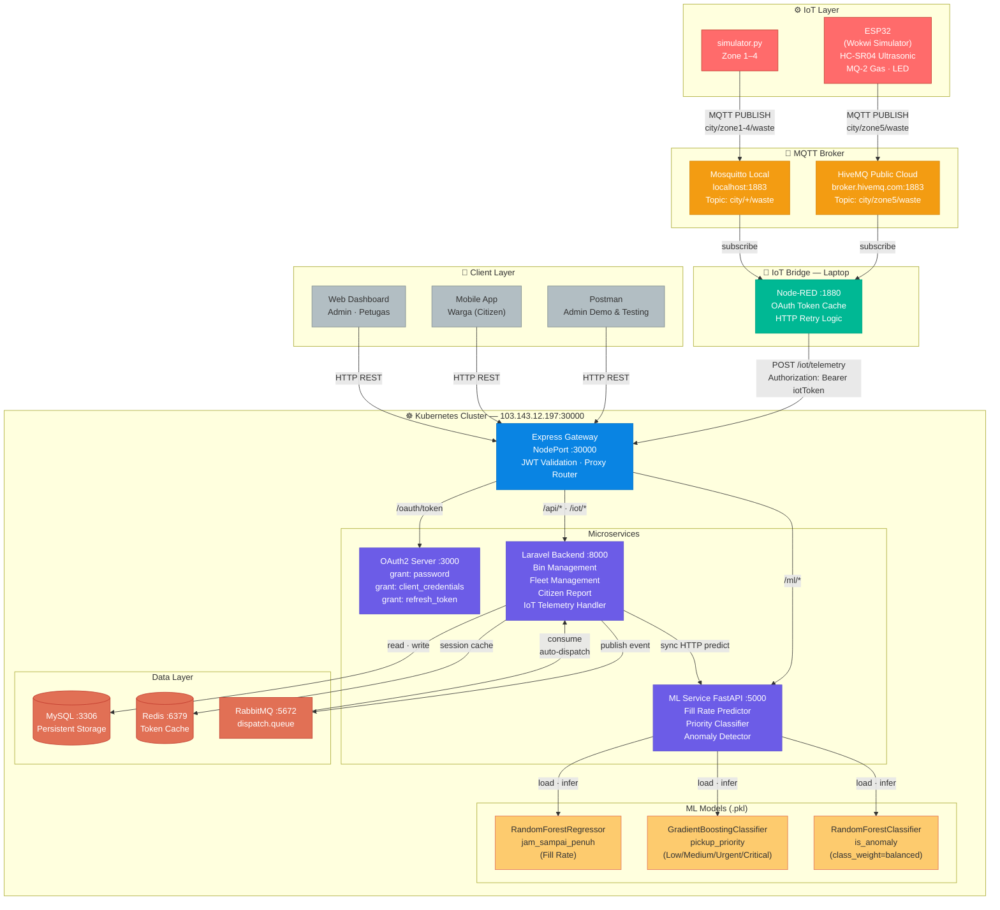
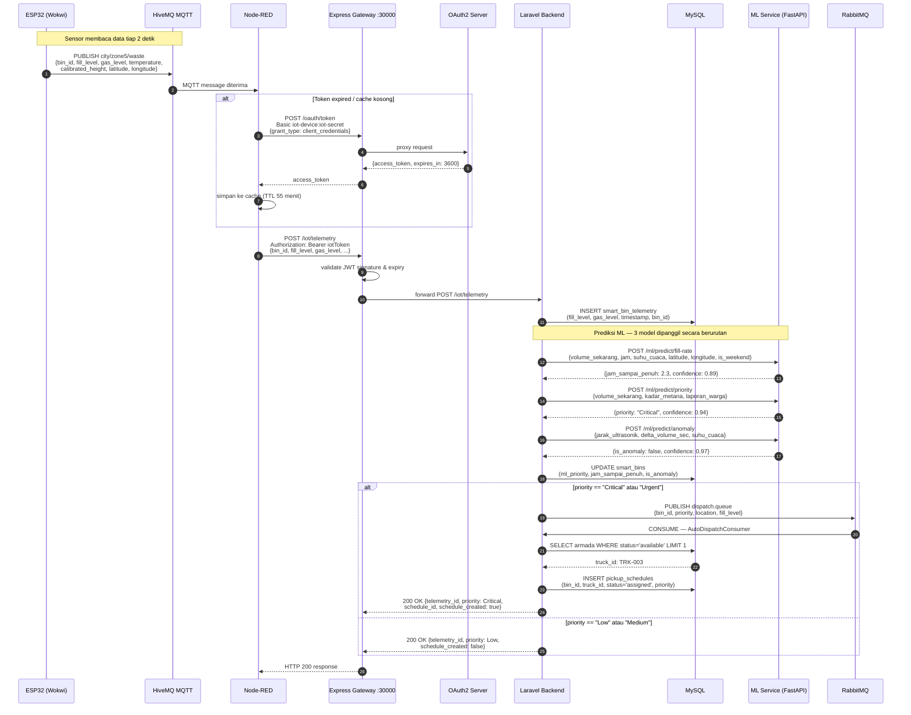
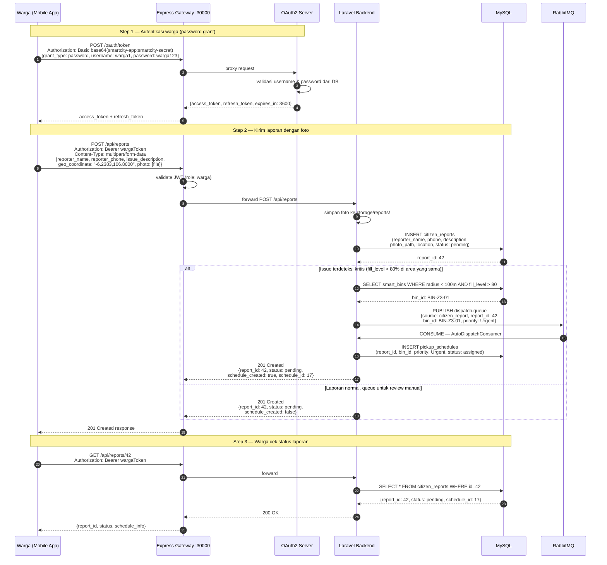
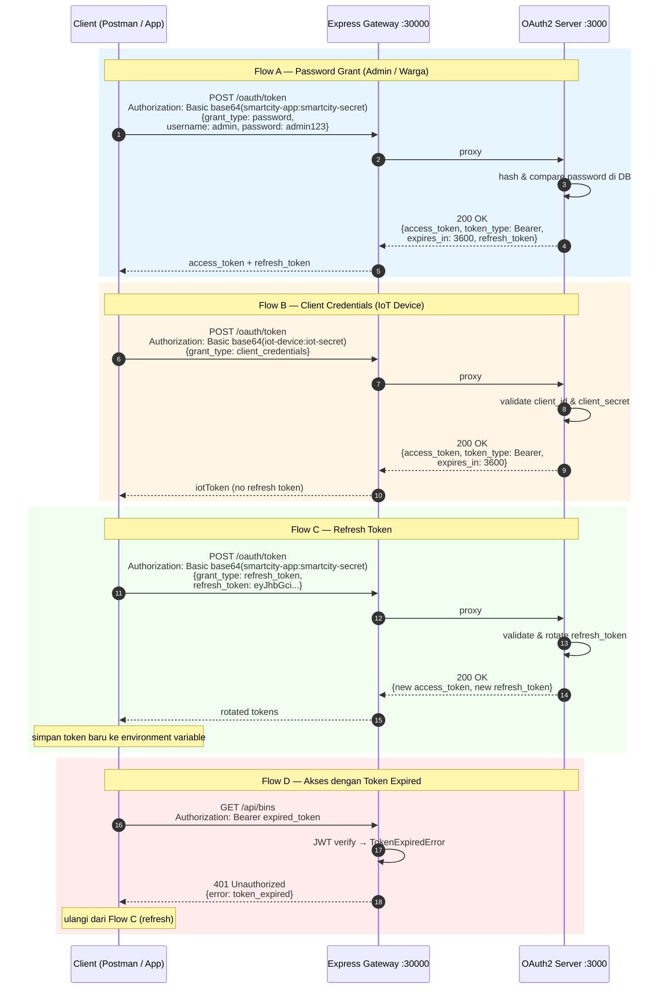
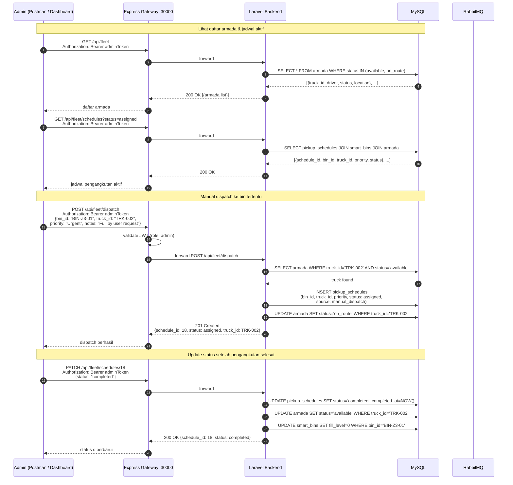

# TrashTrack — System Diagrams
> Paste setiap blok ke [mermaid.live](https://mermaid.live) untuk preview.

---

## 1. System Architecture Diagram

---

## 2. Sequence Diagram — S1: IoT Telemetry → ML Prediction → Auto Dispatch

---

## 3. Sequence Diagram — S2: Citizen Report (Laporan Warga)

---

## 4. Sequence Diagram — OAuth2 Token Flow

---

## 5. Sequence Diagram — S6: Fleet Management & Manual Dispatch

